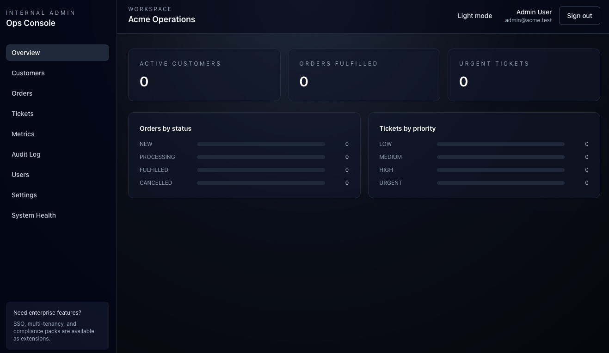
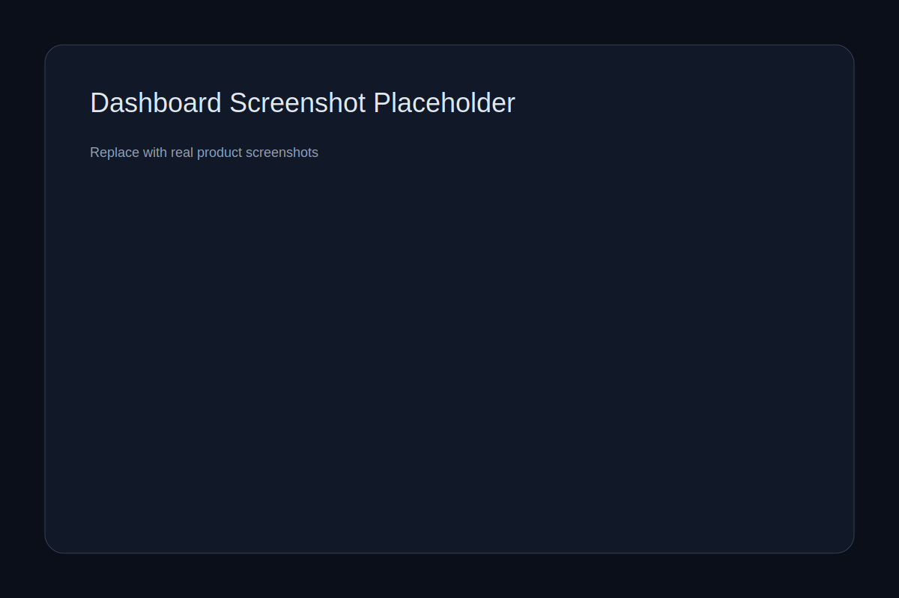
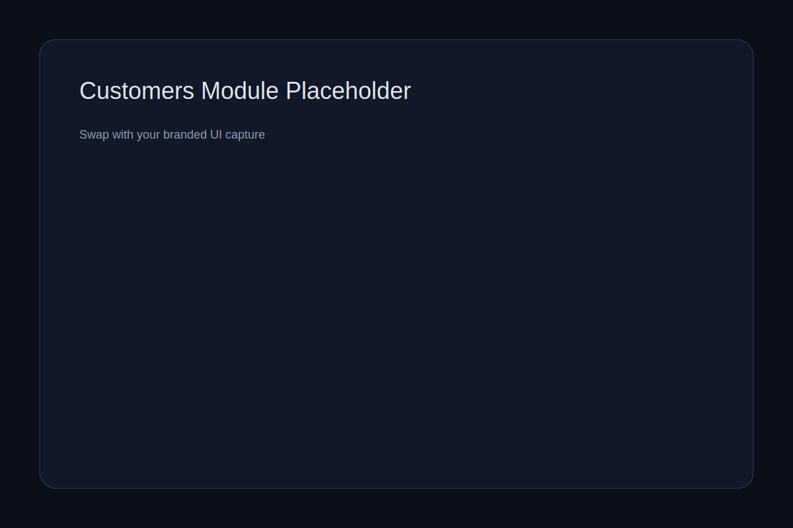
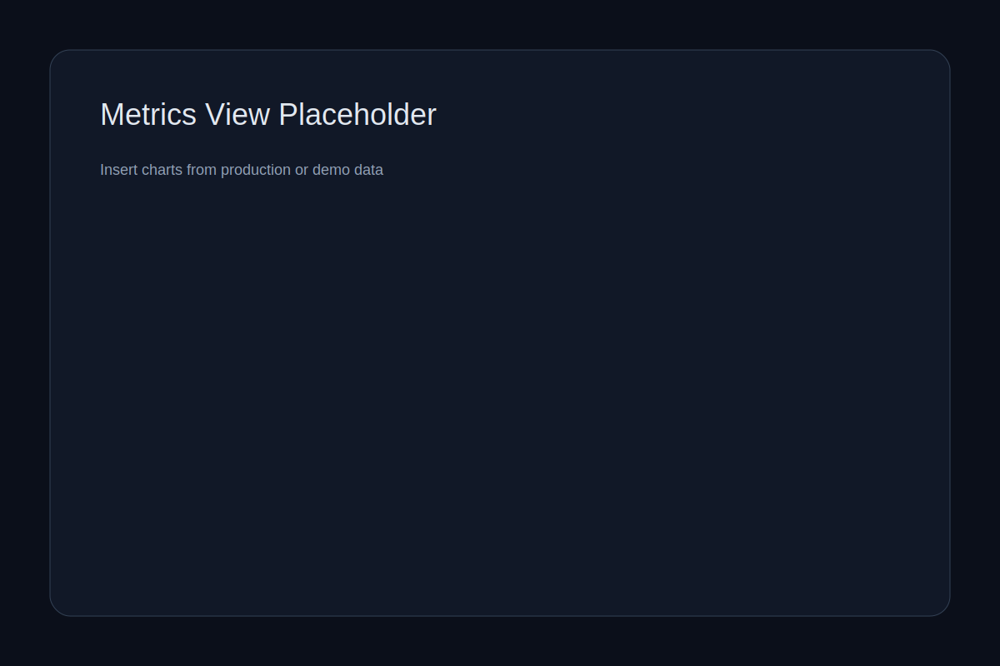

# Internal Admin Dashboard Template

A production-ready internal admin dashboard template with CRUD, RBAC, audit trail, and metrics—built to ship real internal tools fast.





## What You Get
- CRUD modules for Customers, Orders, and Tickets
- Role-based access control with fine-grained permissions
- Audit trail with actor, action, and request context
- Metrics API + dashboard charts
- Admin settings, feature flags, and system health view



## Tech Stack
Backend: Java 21, Spring Boot 3, Spring Security 6, PostgreSQL, Flyway, OpenAPI, Maven, Testcontainers
Frontend: Next.js 14, TypeScript, Tailwind CSS, shadcn/ui, React Query, Zod
Auth: JWT access tokens + refresh token strategy (see `/docs/SECURITY_NOTES.md`)

## Quickstart
```bash
# Run everything in Docker (db, backend, frontend)
docker compose up --build
```

Local dev (no Docker for app servers):
```bash
# 1) Start PostgreSQL (exposes on localhost:56000)
make db

# 2) Start backend
cd backend
mvn spring-boot:run

# 3) Start frontend
cd ../frontend
npm install
npm run dev
```

Optional demo seed:
```bash
make seed
```

Default login:
- `admin@acme.test`
- `admin123!`

## Adding a New Module in 10 Minutes
1. Add a new entity + Flyway migration
2. Add repository, service, controller
3. Add permissions + role mapping
4. Add frontend route + query hooks
5. Add sidebar nav item

Full guide: `docs/EXTENDING_MODULES.md`

## Extension Points (Where Teams Usually Need Expert Help)
- SSO/SAML/OIDC integrations
- Multi-tenant isolation and data partitioning
- Row-level security for complex domains
- Advanced analytics pipelines and BI
- Compliance automation (SOC2/ISO)

## Professional Services
Need enterprise-grade security, custom modules, or a multi-tenant rollout? This template is designed to be extended with expert guidance. Reach out to the author for:
- Architecture reviews and hardening
- RBAC + audit design workshops
- Enterprise auth integrations
- Production deployment and observability



## Documentation
- `docs/ARCHITECTURE.md`
- `docs/RBAC_MODEL.md`
- `docs/AUDIT_TRAIL.md`
- `docs/EXTENDING_MODULES.md`
- `docs/DEPLOYMENT.md`
- `docs/SECURITY_NOTES.md`
- `docs/ROADMAP.md`

## License
MIT. See `LICENSE`.

## Contributing
Small, focused PRs welcome. Please include tests and update docs if behavior changes.
